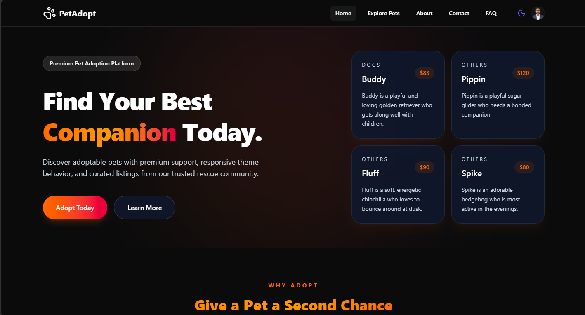

# Pet Adoption Platform



A full-stack pet adoption application built with a Next.js client and an Express + MongoDB backend. The platform supports pet discovery, user authentication, pet management, and an admin dashboard for overseeing listings and users.

## Overview

This repository is split into two main parts:

- Client app: [pet-adoption-platform](https://pet-adoption-platform-drab.vercel.app)
  - Built with Next.js, React, Tailwind CSS, HeroUI, and Better Auth
  - Handles the public site, authentication, pet browsing, user dashboard, and admin dashboard
- Server API: [pet-adoption-server](https://pet-adoption-server-eight.vercel.app)
  - Built with Express and MongoDB
  - Exposes REST endpoints for pets, authentication, profile data, and admin management

## Features

- Browse and search adoptable pets
- View detailed pet information
- Register/login with email and password via Better Auth
- Manage personal pet listings from the user dashboard
- Admin dashboard for stats, recent activity, pet moderation, and user management
- MongoDB-backed persistence for users and pets

## Tech Stack

### Frontend
- Next.js 16
- React 19
- TypeScript
- Tailwind CSS
- HeroUI / @heroui/react
- Lucide React for icons
- Framer Motion for animations
- Better Auth for authentication
- React Hook Form + Zod for form handling and validation
- Recharts for dashboard charts

### Backend
- Express.js
- TypeScript
- MongoDB with the official MongoDB Node.js driver
- Better Auth
- CORS and dotenv
- Zod for request and schema validation

### Development Tools
- ESLint
- PostCSS
- nodemon for server development
- ts-node and TypeScript compiler

## Prerequisites

Make sure you have the following installed:

- Node.js 18 or newer
- npm 9 or newer
- MongoDB running locally or a MongoDB Atlas connection string

## Project Setup

### 1) Clone the project

```bash
git clone <your-repository-url>
cd <your-project-folder>
```

### 2) Install dependencies for the client

```bash
cd pet-adoption-platform
npm install
```

### 3) Install dependencies for the server

```bash
cd ../pet-adoption-server
npm install
```

## Environment Variables

### Client (.env.local in the client folder)

Create a file named .env.local inside [pet-adoption-platform](.) with the following variables:

```env
BETTER_AUTH_URL=http://localhost:3000
NEXT_PUBLIC_BETTER_AUTH_URL=http://localhost:3000
NEXT_PUBLIC_BACKEND_URL=http://localhost:8000
```

### Server (.env in the server folder)

Create a file named .env inside [pet-adoption-server](../pet-adoption-server) with the following variables:

```env
MONGODB_URI=mongodb://127.0.0.1:27017/pet_adoption
BETTER_AUTH_SECRET=your-super-secret-key
PORT=8000
CLIENT_URL=http://localhost:3000
BETTER_AUTH_URL=http://localhost:3000
```

> If you are using MongoDB Atlas, replace the MongoDB URI with your Atlas connection string.

## Running the Application

### Start the server

```bash
cd pet-adoption-server
npm run dev
```

The API will run at:

- http://localhost:8000/api/health

### Start the client

Open a second terminal and run:

```bash
cd pet-adoption-platform
npm run dev
```

Then open:

- http://localhost:3000

## Building for Production

### Client

```bash
cd pet-adoption-platform
npm run build
```

### Server

```bash
cd pet-adoption-server
npm run build
```

## Project Structure

```text
pet-adoption-platform/
  app/                  # Next.js app router pages and layouts
  components/           # Reusable UI components
  public/               # Static assets including the README banner image
  lib/                  # Shared client-side utilities

pet-adoption-server/
  src/                  # Express server source code
    controllers/        # API handlers for pets and admin actions
    routes/             # Route definitions
    middleware/         # Auth middleware
    config/             # Auth and MongoDB configuration
```

## Notes

- The client communicates with the server through the backend URL configured in the client environment file.
- Authentication is handled by Better Auth and uses the shared MongoDB database.
- The admin dashboard requires an authenticated admin user in the database.
